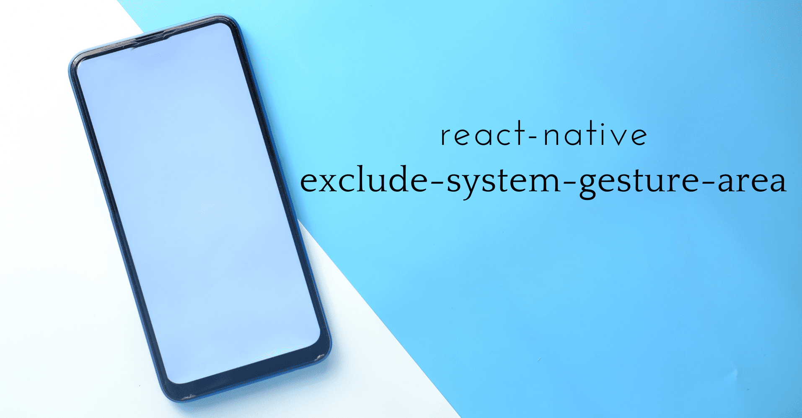

Provide component excluding component area from the android native navigation system gesture.

# Why another component ?

With newest versions of android (10+), users can select navigation with gestures. For example on the latest pixel navigation gestures are set by default.

It comes up with few problems concerning gestures. The android navigation gesture take the ascendant over any other gesture.
And sometimes you would need to override this behavior, in that case you have to use `systemGestureExclusionRects` from the android sdk.
That's exactly what this library does. The component provided wrap your component and add a system gesture exclusion area around your
component.

| ⚠️ Be careful overriding the behavior, make sure that's what you want to do before. Until you really need it Navigation Gesture must be always the priority ! |
| ------------------------------------------------------------------------------------------------------------------------------------------------------------- |

## Installation

```sh
yarn add @wz-mobile/exclude-system-gesture-area
```

## Usage

```js
import { ExcludeSystemGestureAreaView } from '@wz-mobile/exclude-system-gesture-area';

// ...

<ExcludeSystemGestureAreaView>
  <YourComponent />
</ExcludeSystemGestureAreaView>;
```

## Contributing

See the [contributing guide](CONTRIBUTING.md) to learn how to contribute to the repository and the development workflow.

## License

MIT

---

Made with [create-react-native-library](https://github.com/callstack/react-native-builder-bob)
